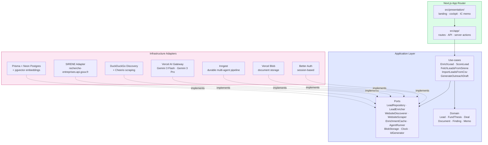
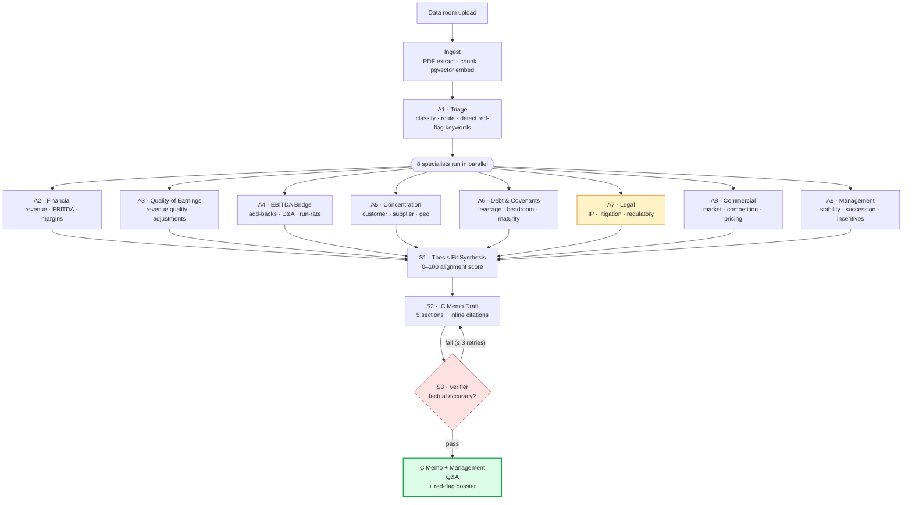

<div align="center">

# Athena

### From data room to IC memo in 30 minutes.

**The AI Due Diligence Copilot for lower-mid-market private equity.**

Upload a data room. Get sourced red flags, management questions, and a draft IC memo with citations on every claim — not in five days, in thirty minutes.

</div>

---

|                  |                                                                                                                                                                                                                                                                                                                                                                                                                                                                                                                                                                                                                                                                                                                              |
| ---------------- | ---------------------------------------------------------------------------------------------------------------------------------------------------------------------------------------------------------------------------------------------------------------------------------------------------------------------------------------------------------------------------------------------------------------------------------------------------------------------------------------------------------------------------------------------------------------------------------------------------------------------------------------------------------------------------------------------------------------------------- |
| **CI / CD**      | [](https://github.com/NerionSoft/hec-polytechnique-hackathon/actions/workflows/ci.yml) [](https://github.com/NerionSoft/hec-polytechnique-hackathon/actions/workflows/release.yml) [](https://github.com/NerionSoft/hec-polytechnique-hackathon/releases)                                                                                                                               |
| **Activity**     | [](https://github.com/NerionSoft/hec-polytechnique-hackathon/commits) [](https://github.com/NerionSoft/hec-polytechnique-hackathon/pulse) [](https://github.com/NerionSoft/hec-polytechnique-hackathon/graphs/contributors) [](https://github.com/NerionSoft/hec-polytechnique-hackathon) |
| **Frontend**     | [](https://nextjs.org/) [](https://react.dev/) [](https://www.typescriptlang.org/) [](https://tailwindcss.com/)                                                                                                                                                                                                                 |
| **Backend & AI** | [](https://www.prisma.io/) [](https://neon.tech/) [](https://www.inngest.com/) [](https://ai.google.dev/) [](https://sdk.vercel.ai/)                                                                                   |
| **Quality**      | [](https://vitest.dev/) [](https://prettier.io/) [](https://eslint.org/) [](#under-the-hood) [](https://www.conventionalcommits.org)                                                 |
| **Runtime**      | [](https://nodejs.org/) [](https://pnpm.io/) [](#hackathon)                                                                                                                                                                                                                                                                                                                                                                                |

---

## The problem (specific, painful, expensive, urgent)

Private equity just lost the 59% of its historical returns that came from cheap leverage and multiple expansion (McKinsey, 2026). Returns now have to come from **picking better deals** and **operating them more efficiently** — and LPs are no longer asking funds _if_ they use AI. They're asking _how_.

The pain has a precise location: a **72-hour window** that occurs at the same moment in every competitive industrial acquisition. The banker has asked for a binding LOI, two or three other funds are bidding, and the deal principal must commit to exclusivity — and to **$300–700k of subsequent advisor costs** — without knowing the answer to the only question that determines whether the deal makes money:

> _What is the actual condition of the asset base, and what will it cost to sustain projected EBITDA after close?_

A seller preparing for exit has every incentive to defer maintenance Capex in the 24–36 months before sale. That inflates EBITDA, inflates FCF conversion, and raises the multiple. The CIM shows a 22% margin and clean cash flow. The data room — when it opens — contains exactly what the seller chose to upload. **None of those documents reveal the deferred Capex gap.** Funds that proceed blind end up owning a business that needs $8M of emergency Capex in year one of a value-creation plan that assumed $2M.

## The solution (the insight, not the feature list)

Athena tells a PE fund **what is hidden in the physical reality of an industrial business _before_ the seller ever opens a data room**.

We monitor every potential target with AI classification across public registries, regulatory databases, and financial signal extraction. If the fund qualifies the target, we push it into the CRM, open the data room, and **replace the manual due-diligence and compliance workstreams with a multi-agent pipeline**. The AI asks management the questions a senior analyst would ask, surfaces sourced red and green flags on the target's behaviour and asset base, and ships an **IC memo with a GO / NO-GO recommendation and every argument cited** — before the LOI is signed.

Three returns, each independently quantifiable:

1. **Pricing arbitrage** — entering LOI with _"$4.2M deferred maintenance, identified from Capex-to-depreciation trending"_ moves the purchase price. Vague concern doesn't.
2. **Aborted-deal cost avoidance** — killing weak deals before $300–700k of advisors are engaged. Eight processes a year, five abort: **$0.9–2.1M saved against a $250k subscription. 4–8× ROI from cost avoidance alone.**
3. **LP narrative** — a documented, proprietary pre-LOI screening methodology is worth points on carry in fundraising negotiations.

## Market (assumptions, not just a number)

- **Europe PE deal value:** €177B in Q3 2025 alone, **+25% YoY** (Mordor Intelligence).
- **Mid-market entry valuations:** 10.5× EBITDA in 2024 vs. 13.1× for large/mega-cap — better return potential, more deal flow, less competition for AI vendors.
- **Virtual data room market:** doubling by 2030 to **>$17B**.
- **AI deal tools:** growing **3× faster than PE itself**.
- **71% of mid-market firms** are already buying AI tooling.
- **LOI-to-SPA timelines lengthened 64%** between 2023 and 2024 — every extra week is an extra week of deferred-Capex discovery creating renegotiation pressure.

We are not betting on a market that might exist. We are inside one **compounding 20% a year, with a two-year window before the winners are locked in.**

## Why now

Three forces converge in 2026 that make this the right moment, and not before:

1. **Capital rotation into Capex-heavy sectors.** As software valuations collapse under AI disruption, PE rotates toward industrial services, contract manufacturing, specialist logistics, infrastructure — exactly the sectors where asset-condition intelligence matters most and where existing AI platforms are useless.
2. **The exit backlog forces entry discipline.** 63% of active PE portfolio companies are held >4 years. Funds that overpaid in 2021–23 are visibly stuck. The market now has documented evidence that intelligence-backed price discipline at entry is the difference between 2.5× and a write-down.
3. **LPs changed the question.** The bar moved from "do you have AI" to "show us the proprietary methodology that justifies your entry pricing." A fund without an answer is a fund that won't close its next vintage.

## Competition

| Existing tools              | What they do                                          | What's missing                                          |
| --------------------------- | ----------------------------------------------------- | ------------------------------------------------------- |
| **Virtual data rooms**      | Storage + RBAC inside the data room                   | Zero intelligence, zero analysis, zero pre-LOI signal   |
| **General PE intelligence** | Lead sourcing, market data                            | No data-room-grade DD, no IC-ready output, no citations |
| **DD advisory firms**       | 6–10 weeks of manual technical / legal / financial DD | Too slow and too expensive for the LOI window           |

Athena is the only platform that does **all of it in one product**: pre-LOI intelligence on the seller's blind spots → data-room-grade multi-agent DD → IC memo with GO/NO-GO and citations. That is the wedge.

## Vision & customer base

- **Customer base:** Lower-mid-market PE & search funds (**$100M–$1B AUM**), with a sharp ICP at the deal principal running 3–8 Capex-intensive acquisitions in parallel inside a $200M–$800M-AUM industrial fund.
- **Sectors:** field maintenance, contract manufacturing, specialist logistics, industrial services, energy, agriculture.
- **Geography:** France first, then DACH, then UK. Lower-mid PE is concentrated, regulated, and under-served by US-centric AI vendors.
- **Business model:** B2B SaaS, mid/low-Capex, France-anchored. Per-fund subscription; per-deal accelerator pricing for the IC memo.

> **Athena is the only platform that tells a PE fund what is hidden in the physical reality of an industrial business before the seller ever opens a data room.**

---

## What you actually get

> The deal cockpit and IC memo mockups in `src/presentation/components/landing/mockups/` show the live product. Numbers below are taken from the **Helios AgriTech** demo deal that ships with the seed data.

| Output                   | Example from demo deal                                                   |
| ------------------------ | ------------------------------------------------------------------------ |
| **Documents ingested**   | 247 PDFs across financial, legal, commercial, HR, IT and tax workstreams |
| **Sourced red flags**    | 12, severity-scored, each citing document + page + clause                |
| **Citations**            | 47 inline source references stitched through the memo                    |
| **IC readiness**         | 87% (9 of 10 workstreams completed and verified)                         |
| **Management questions** | Sharp, sourced, ready to send for the next management meeting            |
| **Time end-to-end**      | ~30 minutes including the verifier loop                                  |

**Sample red flags Athena surfaces automatically:**

- _"Customer concentration: Top-3 customers represent 64% of FY24 revenue"_ — `Annexe-3.xlsx · p.12` — **HIGH**
- _"EBITDA bridge: €2.1M of one-off adjustments to normalize"_ — `P&L 2024.pdf · p.04` — **HIGH**
- _"Senior debt covenant: Headroom breached for 2 quarters in 2024"_ — `Loan agreement.pdf · §4.2` — **MEDIUM**
- _"IP ownership: 2 patents jointly owned with prior employer"_ — `Patent assignment.pdf · §2` — **LOW**

---

## The product, end to end

```mermaid
flowchart LR
    A["Lead Sourcing<br/>SIRENE · brokers · CSV"] --> B["Enrichment<br/>Website discovery · scraping · LLM"]
    B --> C["Thesis Scoring<br/>0–100 fit vs. fund mandate"]
    C --> D["Outreach Draft<br/>personalised, CRM-aware"]
    D --> E["Virtual Data Room<br/>upload · auto-categorise · RBAC"]
    E --> F["Multi-Agent DD<br/>9 specialists in parallel"]
    F --> G["Risk Engine<br/>red & green flags, severity"]
    G --> H["Human Review<br/>analyst validation"]
    H --> I["IC Memo<br/>citations · charts · Q&A"]

    style F fill:#ede9fe,stroke:#7c3aed,stroke-width:2px
    style I fill:#dcfce7,stroke:#16a34a,stroke-width:2px
```



Nine stages from cold lead to IC decision, covering the full deal-team workflow in a **single shared cockpit**: every analyst, every memo, every red flag — sourced, versioned, exportable.

---

## Under the hood

Athena is a **Next.js 16 / React 19 / TypeScript** app built on a strict **hexagonal (ports & adapters)** architecture, with a durable multi-agent LLM pipeline orchestrated by **Inngest** and powered by **Gemini 3 Flash & Pro** through the **Vercel AI Gateway**.

### Hexagonal layout



ESLint enforces the import boundaries: nothing in `src/application/` may import from `src/infrastructure/` or `src/app/`. Adapters are swappable — the AI provider, the search engine, the job runner, the blob store all sit behind ports. **Replacing Gemini with Claude tomorrow is a one-file change.**

### The multi-agent DD pipeline

The diligence engine fans out **eight specialist agents in parallel** across the data room, then synthesises and **self-verifies up to three times** before declaring the memo ready.



| Phase               | Agents                          | Model            | Why this design                                                                    |
| ------------------- | ------------------------------- | ---------------- | ---------------------------------------------------------------------------------- |
| **Ingest**          | PDF extract, chunk, embed       | —                | pgvector means retrieval per agent, not naive whole-file prompting                 |
| **Triage**          | A1                              | Gemini 3 Flash   | Cheap classifier routes documents to the right specialists                         |
| **Specialists**     | A2 – A9 (parallel)              | Gemini 3 Flash   | Eight independent prompts run concurrently — wall-clock collapses                  |
| **Heavy reasoning** | A7 (Legal)                      | Gemini 3 **Pro** | Legal needs the strongest reasoning model; everything else stays on Flash for cost |
| **Synthesis**       | S1 (thesis fit), S2 (memo)      | Gemini 3 Flash   | Deterministic structured output, Zod-validated                                     |
| **Verifier loop**   | S3 (fact-check, ≤ 3 iterations) | Gemini 3 Flash   | Catches hallucinated findings before the memo ships                                |

**Durable execution.** Every agent step is checkpointed by Inngest. If A6 fails on a transient API error, the pipeline retries that step alone — A1, A2 and A3 don't replay. Token counts and cost estimates are logged per call to the `AgentOutput` audit table.

**Idempotent enrichment.** The lead enrichment use-case hashes `(system prompt + user prompt + model + schema version)` to avoid re-spending tokens on identical inputs across sessions. Website snapshots are persisted in their own cache so re-enrichment doesn't re-scrape.

---

## Built for regulated capital

Three things the LPs of a regulated PE fund will ask before they let it within a kilometre of a real deal:

|                           |                                                                                        |
| ------------------------- | -------------------------------------------------------------------------------------- |
| **Sourced on every line** | Every claim cites the underlying document, page and clause. No "the AI said so."       |
| **Secure by default**     | RBAC, session-based auth (Better Auth), encrypted virtual data rooms hosted in the EU. |
| **Audit-ready logs**      | Every agent call, every export, every analyst override is traceable in the database.   |

---

## Quickstart

```bash
git clone git@github.com:NerionSoft/hec-polytechnique-hackathon.git
cd hec-polytechnique-hackathon
pnpm install

cp .env.example .env.local
# Required: DATABASE_URL, BETTER_AUTH_SECRET, AI_GATEWAY_API_KEY, BLOB_READ_WRITE_TOKEN

pnpm db:migrate     # apply Prisma migrations to Neon
pnpm db:seed        # create demo user + two fund theses
pnpm dev            # http://localhost:3000
```

### Demo credentials

| Field     | Value               |
| --------- | ------------------- |
| Email     | `demo@athena-pe.io` |
| Password  | `DemoAthena2026!`   |
| Workspace | Demo PE SME Fund    |

The seed creates two ready-to-use investment theses:

1. **Lower-mid B2B SaaS — France** (€5M–€50M, founder-owned, recurring revenue, profitable, niche).
2. **Buy-and-build — Industrial services DACH+FR** (€8M–€80M, fragmented market, succession risk).

Sign in via `POST /api/auth/sign-in/email` or the temporary `/admin` UI.

## Common commands

```bash
pnpm dev               # Next dev server
pnpm build             # Production build
pnpm typecheck         # tsc --noEmit
pnpm lint              # ESLint
pnpm format            # Prettier write
pnpm test              # Vitest (unit + integration)
pnpm test:unit         # tests/unit/**/*.test.ts
pnpm test:integration  # tests/integration/**/*.integration.test.ts

pnpm db:generate       # Regenerate Prisma client
pnpm db:migrate        # prisma migrate dev (uses .env.local)
pnpm db:push           # prisma db push (no migration file, fast for hackathon iterations)
pnpm db:seed           # Run prisma/seed.ts
pnpm db:studio         # Prisma Studio
```

---

## API surface

Auth-gated routes require a Better Auth session cookie set via `/api/auth/sign-in/email`.

| Method                 | Route                      | Purpose                                                |
| ---------------------- | -------------------------- | ------------------------------------------------------ |
| `POST`                 | `/api/auth/sign-up/email`  | Create user                                            |
| `POST`                 | `/api/auth/sign-in/email`  | Sign in, returns session cookie                        |
| `GET` `POST`           | `/api/theses`              | List / create fund thesis                              |
| `GET` `PATCH` `DELETE` | `/api/theses/[id]`         | Get / update / soft-delete                             |
| `GET`                  | `/api/leads`               | List leads (filter by status, thesis, pagination)      |
| `GET`                  | `/api/leads/[id]`          | Lead detail                                            |
| `POST`                 | `/api/leads/source/sirene` | Source from `recherche-entreprises.api.gouv.fr`        |
| `POST`                 | `/api/leads/import`        | Multipart CSV upload → Vercel Blob → import            |
| `POST`                 | `/api/leads/[id]/enrich`   | Discover website · scrape · Gemini enrich (idempotent) |
| `POST`                 | `/api/leads/[id]/score`    | Deterministic PE-thesis scoring                        |

---

## Tech stack

| Layer               | Choice                                                              | Why                                                                |
| ------------------- | ------------------------------------------------------------------- | ------------------------------------------------------------------ |
| Framework           | **Next.js 16** (App Router, Turbopack), React 19                    | Single deployable for SSR, RSC, server actions, edge-ready API     |
| Language            | **TypeScript 5 strict**                                             | Type safety end-to-end, including AI output schemas via Zod 4      |
| Styling             | **Tailwind v4** (CSS-only config in `globals.css`)                  | No `tailwind.config.*` — tokens & themes live in CSS               |
| Database            | **Postgres on Neon** + `pgvector`                                   | Branchable serverless Postgres + native vector retrieval per agent |
| ORM                 | **Prisma 6**                                                        | Type-safe queries, idiomatic migrations                            |
| Auth                | **Better Auth 1.6**                                                 | Session-based, OAuth-ready, hexagonally adaptable                  |
| LLM                 | **Vercel AI SDK 6** + **`@google/genai`** (Gemini 3 Flash & Pro)    | Provider-agnostic at the SDK seam; swap models in one file         |
| Job orchestration   | **Inngest 4**                                                       | Durable, checkpointed, parallel-friendly multi-agent steps         |
| Document processing | **`unpdf`** (extraction), **`cheerio`** (scraping), `robots-parser` | Boring, robust, zero-config in serverless environments             |
| File storage        | **Vercel Blob 2**                                                   | Serverless, signed URLs, no S3 plumbing                            |
| Animation / charts  | Framer Motion 12, Recharts 3, Lucide                                | Cockpit polish without a design-system rebuild                     |
| Testing             | **Vitest 4** (unit + integration projects)                          | Fast, TS-native, project-aware coverage                            |
| Tooling             | ESLint 9, Prettier 3, Husky, lint-staged, release-please            | Hooks + Conventional Commits + automated tagging                   |

---

## Testing strategy

Tests live next to the code, two flavours run as separate Vitest projects:

```bash
pnpm test              # unit + integration
pnpm test:unit         # src/application/**/*.test.ts          — pure, in-process, no I/O
pnpm test:integration  # src/infrastructure/**/*.integration.test.ts — real DB, real APIs
pnpm test:coverage     # both, with lcov for reporting
```

The application layer is tested against **fake adapters** (`src/application/test-support/fakes/`) — `InMemoryLeadRepository`, `FakeLeadEnricher`, `FakeWebsiteDiscoverer`, `FakeWebsiteScraper`, `FakeClock`. Use-cases are pure functions of their dependencies; they never touch I/O in unit tests, and CI runs unit and integration in parallel jobs.

```bash
pnpm lint              # ESLint flat config (enforces hexagonal boundaries)
pnpm typecheck         # tsc --noEmit
pnpm format:check      # Prettier (CI parity)
```

`.husky/pre-commit` runs `lint-staged` (ESLint --fix + Prettier on staged files) so commits are clean before they hit the branch.

---

## CI / release

- **CI** (`.github/workflows/ci.yml`) — lint, format, typecheck in parallel → unit tests + coverage upload, integration tests in parallel → build. Pinned action SHAs, Node 24, concurrency cancels in-flight runs on the same ref.
- **Release** (`.github/workflows/release.yml`) — `release-please` on push to `main` reads Conventional Commits, opens a release PR, cuts a tag, and maintains floating `vMAJOR` and `vMAJOR.MINOR` tags.

---

## Roadmap

- [x] Hexagonal foundation (domain · ports · adapters · use-cases)
- [x] Fund-thesis CRUD with deterministic PE scoring
- [x] Lead sourcing — SIRENE adapter + CSV importer
- [x] Lead enrichment — DuckDuckGo discovery + Cheerio scraper + Gemini, dual-cache
- [x] Multi-agent DD pipeline — Inngest, 8 specialists in parallel + S1/S2/S3 verifier loop
- [x] Document ingest with pgvector retrieval per agent
- [x] Cockpit & IC memo mockups (landing + in-app)
- [ ] Human-review checkpoints in the cockpit
- [ ] Outreach automation wired to CRM (HubSpot, Affinity)
- [ ] Multi-fund consolidation (cross-fund pipeline, audit logs, RBAC matrix)
- [ ] Cap-table & financial sensitivity engine (returns waterfall, IRR scenarios)
- [ ] SOC 2 / ISO 27001 evidence pack

---

## Hackathon

Athena is the hackathon entry of **Nerion Soft** for the **HEC × Polytechnique 2026 Hackathon** — _"AI agents that actually do the work."_

Built by a small team in a weekend. No mocks behind the demo: real SIRENE calls, real Gemini agents, real durable workflows, real cited memos.

> **Athena Technologies Limited builds AI tooling for private equity deal teams. Athena is not a regulated investment adviser; outputs are decision-support artefacts and do not constitute financial advice.**

## License

Hackathon project — not for production use. See [`CLAUDE.md`](./CLAUDE.md) for engineering conventions and architecture details.
